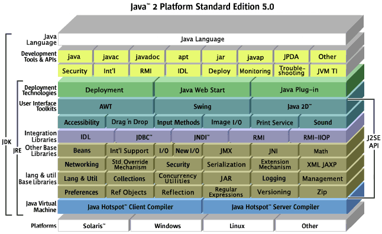

# Interview questions
## 基本概念

 1. 操作系统中 heap 和 stack 的区别 
    * heap是堆，stack是栈。
    * stack的空间由操作系统自动分配和释放，heap的空间是手动申请和释放的，heap常用new关键字来分配。
    * stack空间有限，heap的空间是很大的自由区。
    
    在Java中，若只是声明一个对象，则先在栈内存中为其分配地址空间，若再new一下，实例化它，则在堆内存中为其分配地址。
    
    栈是用来静态分配内存的而堆是动态分配内存的，它们都是存在于计算机内存之中。

    栈的分配是在程序编译的时候完成的，直接存储在内存中，接触内存很快。栈是后进先出的顺序，最后被申请的块最先被释放，这样就很容易跟踪到栈，释放栈的过程简单到仅仅是移动下指针就能完成。

    堆的分配是在程序运行时完成的，分配速度较为缓慢，但是堆的可用空间非常的大。堆中的元素相互之间没有关联，各自都可以被任何时候随机访问。我们可以任何时候申请和释放一块内存，这样会使得我们很难随时随地追踪到堆中某块位置被分配了还是被释放了。

    当你知道在编译前需要分配多少数据时且数据量不是很大时可以使用栈。如果不知道在运行时需要多少数据那么就该使用堆。

    在多线程的程序里，每个线程都有其自己独立的栈，它们都共享一个堆。栈是面向线程的而堆是面向进程的。
    
    **栈内存**：在函数中定义的一些基本类型的变量和对象的引用变量都在函数的栈内存中分配。 栈内存主要存放的是基本类型类型的数据 如、( int, short, long, byte, float, double, boolean, char) 和对象句柄。并没有有String基本类型、在栈内存的数据的大小及生存周期是必须确定的、其优点是寄存速度快、、栈数据可以共享、缺点是数据固定、不够灵活。
    
    栈的共享：
    ```java
    String a = "abc";
    String b = "abc";
    System.out.println(a==b);//true
    ```
    
    **堆内存**：
    堆内存用来存放所有new 创建的对象和 数组的数据、
    
    ```java
    String a = new String ("abc");
    String b = "abc";
    System.out.println(a==b);  //false
    String a = new String ("abc");
    String b = new String ("abc");
    System.out.println(a==b);  //false
    ```
 2. 什么是基于注解的切面实现
 3. 什么是 对象/关系 映射集成模块
 4. 什么是 Java 的反射机制
 5. 什么是 ACID
 6. BS与CS的联系与区别
 7. Cookie 和 Session的区别
 8. fail-fast 与 fail-safe 机制有什么区别
 9. get 和 post请求的区别
 10. Interface 与 abstract 类的区别
 11. IOC的优点是什么
 12. IO 和 NIO的区别，NIO优点
 13. Java 8 / Java 7 为我们提供了什么新功能
 14. 什么是竞态条件？ 举个例子说明。
 15. JRE、JDK、JVM 及 JIT 之间有什么不同
       **JDK:** Java Development ToolKit(Java开发工具包)。JDK是整个JAVA的核心，包括了Java运行环境（Java Runtime Envirnment），一堆Java工具（javac/java/jdb等）和Java基础的类库（即Java API 包括rt.jar）。  
       **JRE:** Java  Runtime  Enviromental(java运行时环境)。也就是我们说的JAVA平台，所有的Java程序都要在JRE下才能运行。包括JVM和JAVA核心类库和支持文件。与JDK相比，它不包含开发工具——编译器、调试器和其它工具。
       **JVM:** Java Virtual Mechinal(JAVA虚拟机)。JVM是JRE的一部分，它是一个虚构出来的计算机，是通过在实际的计算机上仿真模拟各种计算机功能来实现的。JVM有自己完善的硬件架构，如处理器、堆栈、寄存器等，还具有相应的指令系统。JVM 的主要工作是解释自己的指令集（即字节码）并映射到本地的 CPU 的指令集或 OS 的系统调用。Java语言是跨平台运行的，其实就是不同的操作系统，使用不同的JVM映射规则，让其与操作系统无关，完成了跨平台性。JVM 对上层的 Java 源文件是不关心的，它关注的只是由源文件生成的类文件（ class file ）。类文件的组成包括 JVM 指令集，符号表以及一些补助信息。
       
    
 16. 什么是控制反转（Inversion of Control）与依赖注入（Dependency Injection）
 17. MVC的各个部分都有那些技术来实现?如何实现?
 18. RPC 通信和 RMI 区别 
 19. 什么是 Web Service（Web服务）
 20. JSWDL开发包的介绍。JAXP、JAXM的解释。SOAP、UDDI,WSDL解释。 
 21. WEB容器主要有哪些功能? 并请列出一些常见的WEB容器名字。
 22. 一个".java"源文件中是否可以包含多个类（不是内部类）？有什么限制
 23. 简单说说你了解的类加载器。是否实现过类加载器
 24. 解释一下什么叫AOP（面向切面编程）
 25. 请简述 Servlet 的生命周期及其相关的方法
 26. 请简述一下 Ajax 的原理及实现步骤
 27. 简单描述Struts的主要功能
 28. 什么是 N 层架构
 29. 什么是CORBA？用途是什么
 30. 什么是Java虚拟机？为什么Java被称作是“平台无关的编程语言”
 31. 什么是正则表达式？用途是什么？哪个包使用正则表达式来实现模式匹配
 32. 什么是懒加载（Lazy Loading）
 33. 什么是尾递归，为什么需要尾递归
 

